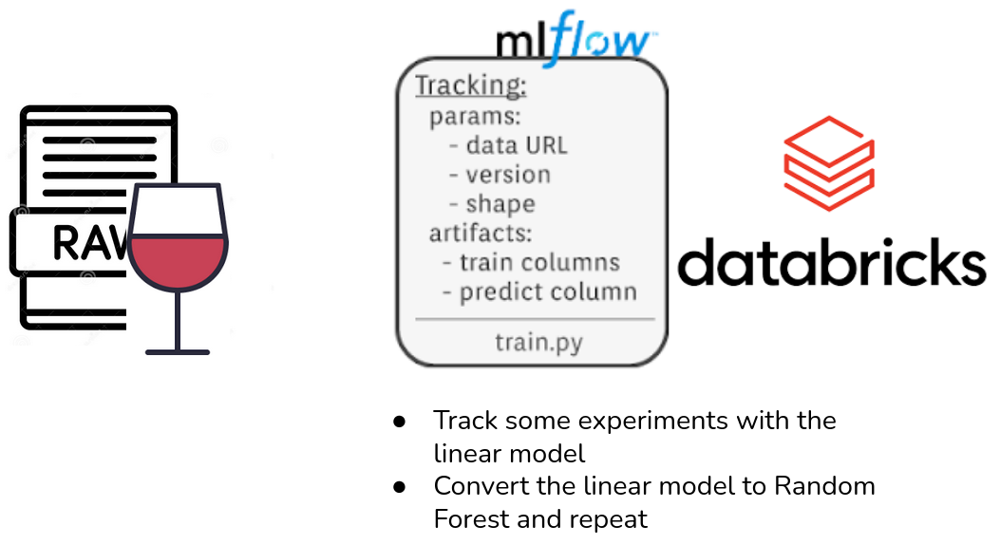

## Experiment tracking

**Objectives:**

- Demonstrate how experiment tracking helps with linking the code, the results and the environment details.
- Note how this increases the reproducibility.

**Dependencies:**

- notebook: `wine_linear_regression.ipynb`

**Instructions:**

1. Install `mlflow`and `sklearn` to your virtual environment: `pip install mlflow sklearn`.
2. Open the `wine_linear_regression.ipynb` with jupyter.
2. Modify the notebook to track the model metrics with mlflow.
3. Test the different parameters of the model.
4. **Note**: every time that you execute the code, mlflow will create a new run in your working directory (`lab-resources`) and save the metrics and other artifacts. You can see it in the working directory, folder `mlruns`.
5. To display the mlflow dashboard, go to the terminal to you working directory and run `mlflow ui`. Then open it in your browser on `localhost:5000`.   
6. Change the model to Random Forest.
7. Track some more experiments and compare the results.
8. Explore the objects, saved by the mlflow.

**Schema:**

**External links:**

- article [Experiment tracking with MLflow on Databricks Community Edition](https://www.adaltas.com/en/2020/09/10/databricks-community-edition-mlflow/)
- article [MLflow tutorial: an open source Machine Learning (ML) platform](https://www.adaltas.com/en/2020/03/23/mlflow-open-source-ml-platform-tutorial/)
